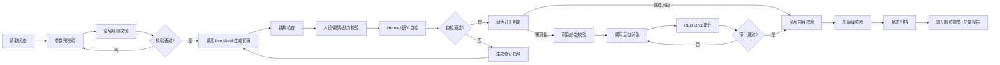

# 小说专用MCP集成指南
---
## 可用MCP列表（已部署）
| MCP服务名称 | 地址 | 功能 |
|-------------|------|------|
| `litellm-memory-novel` | `http://127.0.0.1:4000/mcp/memory_novel` | 小说专用分布式记忆库，支持多项目隔离、版本回溯、结构化查询 |
| `litellm-firstory` | `http://127.0.0.1:4000/mcp/firstory` | 三重质量校验：人设OOC/时间线一致性/战力体系合规检查 |
| `litellm-uno` | `http://127.0.0.1:4000/mcp/uno` | 全局规则引擎：红线内容检测、违禁词扫描、写作规范校验 |
| `litellm-publishready` | `http://127.0.0.1:4000/mcp/publishready` | 出版级终检：AI特征降低、格式标准化、可读性评分 |
---
## 增强流水线嵌入位置

---
## MCP调用封装（可直接嵌入hooks/utils.py）
```python
import requests
from pathlib import Path
def load_mcp_config() -> dict:
    """从项目配置文件读取MCP相关设置"""
    # 读取novel-pipeline.json配置
    cwd = Path.cwd()
    for parent in [cwd] + list(cwd.parents)[:5]:
        config_file = parent / "novel-pipeline.json"
        if config_file.exists():
            import json
            with open(config_file, "r", encoding="utf-8") as f:
                config = json.load(f)
            return {
                "storage_mode": config.get("state_storage_mode", "local_file"),
                "memory_endpoint": config.get("mcp_memory_novel_endpoint", "http://127.0.0.1:4000/mcp/memory_novel"),
                "firstory_endpoint": "http://127.0.0.1:4000/mcp/firstory",
                "uno_endpoint": "http://127.0.0.1:4000/mcp/uno",
                "publishready_endpoint": "http://127.0.0.1:4000/mcp/publishready",
                "api_key": "sk-1234" # 从.env读取更安全
            }
    return {}
def call_mcp(endpoint: str, method: str, params: dict) -> dict:
    """统一MCP调用封装"""
    config = load_mcp_config()
    headers = {
        "Authorization": f"Bearer {config.get('api_key', '')}",
        "Content-Type": "application/json"
    }
    resp = requests.post(f"{endpoint}/{method}", json=params, headers=headers, timeout=30)
    resp.raise_for_status()
    return resp.json()
```