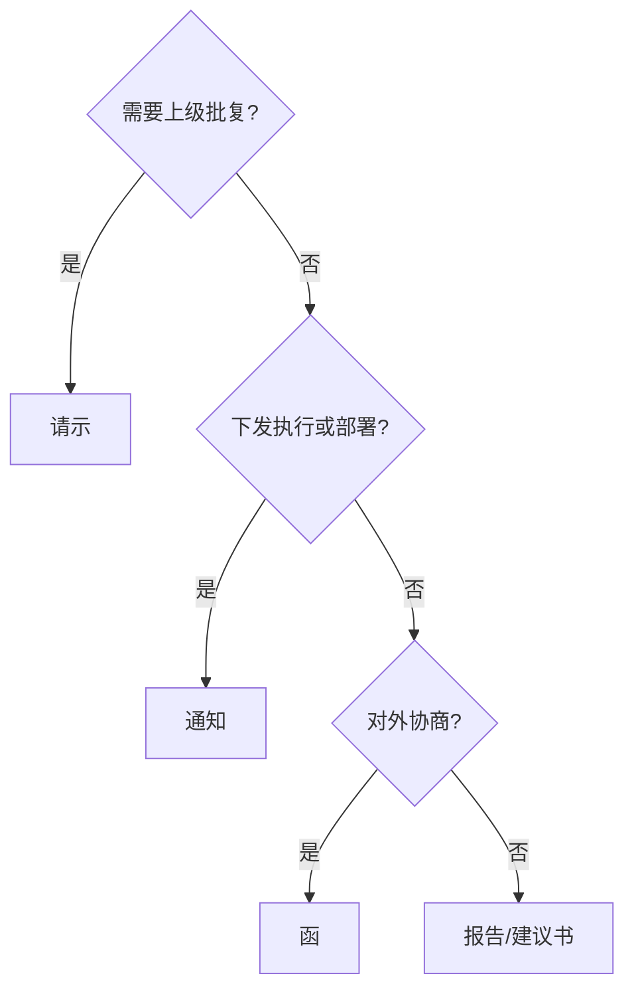

# 公文写作 — 工作流与导出

## 一、起草前澄清（3-5个问题）

| 需确认项 | 典型问题 | 处理方式 |
|----------|----------|----------|
| 发文对象 | 向谁发？上级/下级/平行/对外？ | 缺失时先提问 |
| 行文目的 | 需批复？仅汇报？需执行？商洽？提醒？ | 根据目的选文种 |
| 事项边界 | 一件事还是多件事？ | 多事项拆分 |
| 依据材料 | 文件、数据、时间、金额、领导姓名 | 未提供标注"待核实" |

---

## 二、输出模式

| 模式 | 适用场景 | 输出内容 |
|------|----------|----------|
| 简版 | 用户要求先看框架或快速草拟 | .md 文件：标题、文种、要点、待确认事项；对话仅摘要 |
| 正式版 | 默认，直接发文或提交 | .md 文件：完整正文、附件说明、修改记录、待确认事项；对话仅摘要 |

**默认**：直接创建正式版；仅当用户明确要求"先给提纲/框架/简版"时创建简版。

---

## 三、文件命名与版本管理

### 命名规则

- 格式：`公文_<文种>_<事由简称>.md`
- 示例：`公文_请示_申请信息化项目立项.md`

### 版本后缀

| 阶段 | 后缀 | 示例 |
|------|------|------|
| 草稿 | `_v0x草稿` | `公文_请示_XX_v01草稿.md` |
| 审核 | `_v0x_review` | `公文_请示_XX_v01_review.md` |
| 定稿 | `_v1.0` | `公文_请示_XX_v1.0.md` |
| 紧急 | `_urgent` | `公文_请示_XX_urgent.md` |

### 修改记录（模板）

```markdown
## 修改记录

| 版本 | 修改人 | 修改日期 | 主要改动 |
|------|--------|----------|----------|
| v0.1 | 张三 | 2026-06-04 | 初稿 |
| v0.2 | 李四 | 2026-06-05 | 按意见精简正文 |
```

---

## 四、文种决策树



---

## 五、协作与审批

起草人 → 审核人（1-2人内部初审）→ 领导审核 → 编办定稿 → 发文

---

## 六、紧急公文

1. 文件名加 `_urgent` 后缀，文首注"（紧急）"
2. 先电话通知审批人取得口头同意
3. 24小时内补齐书面材料进入正式流程
4. 明确时限（如"当日内签发""2工作日内回复"）

---

## 七、修改类输出规范

修改已有公文时，在 .md 文件末尾加改动说明表，对话同步呈现：

```markdown
## 改动说明

| 序号 | 改动项 | 原文表述 | 调整后表述 | 改动理由 |
|:--:|--------|----------|------------|----------|
| 1 | 文种调整 | 请示报告 | 请示 | 请示与报告不得叠用 |
| 2 | 标题规范 | 关于XX的请示报告 | 关于XX的请示 | 修正文种 |
| 3 | 精简合并 | …… | …… | 重复内容合并 |
```

---

## 八、导出

### Pandoc 导出 .docx

```bash
pandoc "文件.md" -s -o "文件.docx" -t docx --reference-doc "模板路径.docx"
```

> **模板路径**：优先使用 `C:\Users\<用户名>\Documents\custom-reference.docx`（Windows）或 `~/Documents/custom-reference.docx`（Linux/macOS）。不存在时跳过 `--reference-doc` 参数。

### PDF 导出

先导出 .docx，再用 Word/LibreOffice 另存为 PDF：

```bash
pandoc "文件.md" -s -o "文件.docx" -t docx --reference-doc "模板路径.docx"
# 然后用 Word 或 LibreOffice 将 .docx 另存为 PDF
```

### OA 对接

- 导出时填充文档属性（Title/Author/Date）
- 定稿后由编办生成 PDF 并调用电子印章系统
- 记录电子签章流水号并存档
