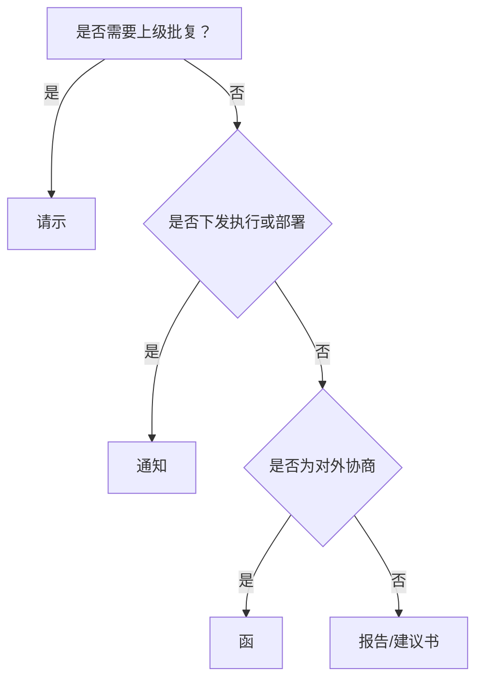

# 公文写作 — 工作流与导出规范

本文件包含起草流程、版本管理、协作审批、决策树、紧急处理。

---

## 〇、核心输出规则（优先级最高）

1. **先建文件再写作**：始终在项目目录创建 `.md` 文件，命名格式 `公文_<文种>_<事由简称>.md`
2. **对话仅输出摘要**：摘要不超过5行，含标题、文种、核心内容、待确认事项；全文写入 `.md` 文件
3. **文件结构**：正文 → 附件说明 → 待确认事项 → 改动说明（如有修改）
4. **待确认项强制**：所有不确定数据/人名/日期用"XX"占位，列入 `## 待确认事项` 清单

---

## 一、起草前澄清（3-5个问题）

起草前先确认以下信息，不足时先提问：

| 需确认项 | 典型问题                             | 处理方式             |
| -------- | ------------------------------------ | -------------------- |
| 发文对象 | 向谁发？上级/下级/平行/对外？        | 缺失时先提问         |
| 行文目的 | 需批复？仅汇报？需执行？商洽？提醒？ | 根据目的选文种       |
| 事项边界 | 一件事还是多件事？                   | 多事项拆分           |
| 依据材料 | 文件、数据、时间、金额、领导姓名     | 未提供时标注"待核实" |

---

## 二、输出模式

| 模式   | 适用场景                       | 输出内容                                                                  |
| ------ | ------------------------------ | ------------------------------------------------------------------------- |
| 简版   | 用户明确要求先看框架或快速草拟 | 在 `.md` 文件中写入标题、文种、要点、待确认事项；对话只给摘要             |
| 正式版 | 默认模式，适用于直接发文或提交 | 在 `.md` 文件中写入完整正文、附件说明、修改记录、待确认事项；对话只给摘要 |

**默认**：直接创建正式版 `.md` 文件并写入全文；仅当用户明确要求“先给提纲/框架/简版”时，才创建简版文件。

---

## 三、文件命名与版本管理

### 命名规则

- 格式：`公文_<文种>_<事由简称>.md`
- 示例：`公文_请示_申请信息化项目立项.md`

### 版本后缀

| 阶段 | 后缀          | 示例                         |
| ---- | ------------- | ---------------------------- |
| 草稿 | `_v0x草稿`    | `公文_请示_XX_v01草稿.md`    |
| 审核 | `_v0x_review` | `公文_请示_XX_v01_review.md` |
| 定稿 | `_v1.0`       | `公文_请示_XX_v1.0.md`       |
| 紧急 | `_urgent`     | `公文_请示_XX_urgent.md`     |

### 修改记录模板

在文末添加：

```
## 修改记录
| 版本 | 修改人 | 修改日期 | 主要改动 |
|------|--------|----------|----------|
| v0.1 | 张三   | 2026-06-04 | 初稿 |
| v0.2 | 李四   | 2026-06-05 | 按意见精简正文 |
```

---

## 四、协作与审批流程

1. **角色**：起草人 → 审核人 → 领导签发 → 编办发文
2. **步骤**：起草 → 内部初审（1-2人）→ 汇总意见 → 领导审核 → 编办定稿 → 发文

---

## 五、文种决策树



---

## 六、紧急公文处理

1. 文件名增加 `_urgent` 后缀，文首加注"（紧急）"
2. 先电话通知审批人取得口头同意
3. 24小时内补齐书面材料并进入正式流程
4. 明确时限（如"当日内签发""2 工作日内回复"）

---

## 七、导出与 OA 对接

### 导出执行规则

1. 用户要求“导出 Word”“转 Word”“生成 docx”时，优先后台执行 `pandoc` 命令，不调用 VS Code Task，避免在 VS Code 中打开或聚焦 PowerShell/终端面板。
2. 导出命令完成后，只在对话中反馈成功或失败、生成文件路径、必要的错误摘要；不要求用户查看终端输出。
3. 默认使用当前 `.md` 文件同目录、同名 `.docx` 作为输出路径，除非用户指定其他文件名或目录。
4. 默认使用参考模板 `C:\Users\Administrator\Documents\custom-reference.docx`。如模板不存在或 `pandoc` 不可用，应在对话中说明原因，并给出可执行的替代方案。
5. 若目标 `.docx` 已存在，可直接覆盖；如用户明确要求保留旧版本，则增加版本后缀。

### Pandoc 导出 .docx

```powershell
pandoc "文件.md" -s -o "文件.docx" -t docx --reference-doc "C:\Users\Administrator\Documents\custom-reference.docx"
```

### OA 对接建议

- 导出时填充文档属性（Title/Author/Date）便于 OA 抓取
- 定稿后由编办生成 PDF 并调用电子印章系统
- 文档须记录电子签章流水号并存档

> 详细导出脚本与样式映射方法见仓库交互脚本或向助手索取。

### PDF 导出

先导出 .docx，再转换 PDF：

```powershell
pandoc "文件.md" -s -o "文件.docx" -t docx --reference-doc "C:\Users\Administrator\Documents\custom-reference.docx"
# 然后用 Word 或 LibreOffice 将 .docx 另存为 PDF
```

---

## 八、修改类输出规范

修改已有公文时，须在 `.md` 文件末尾添加改动说明表格：

```markdown
## 改动说明

| 序号 | 改动项   | 原文表述         | 调整后表述   | 改动理由               |
| :--: | -------- | ---------------- | ------------ | ---------------------- |
|  1   | 文种调整 | 请示报告         | 请示         | 请示与报告不得叠用     |
|  2   | 标题规范 | 关于XX的请示报告 | 关于XX的请示 | 修正文种               |
|  3   | 精简合并 | ……               | ……           | 两条内容重复，合并表述 |
```

同时在对话中以表格形式呈现改动说明。
